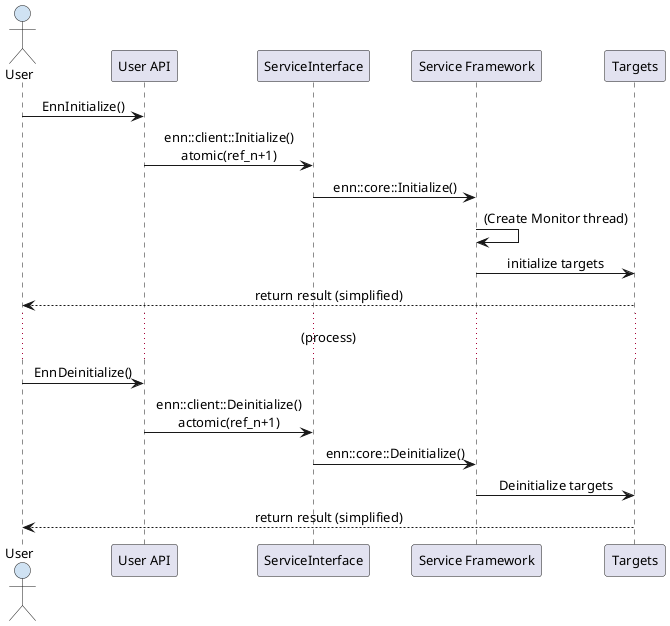
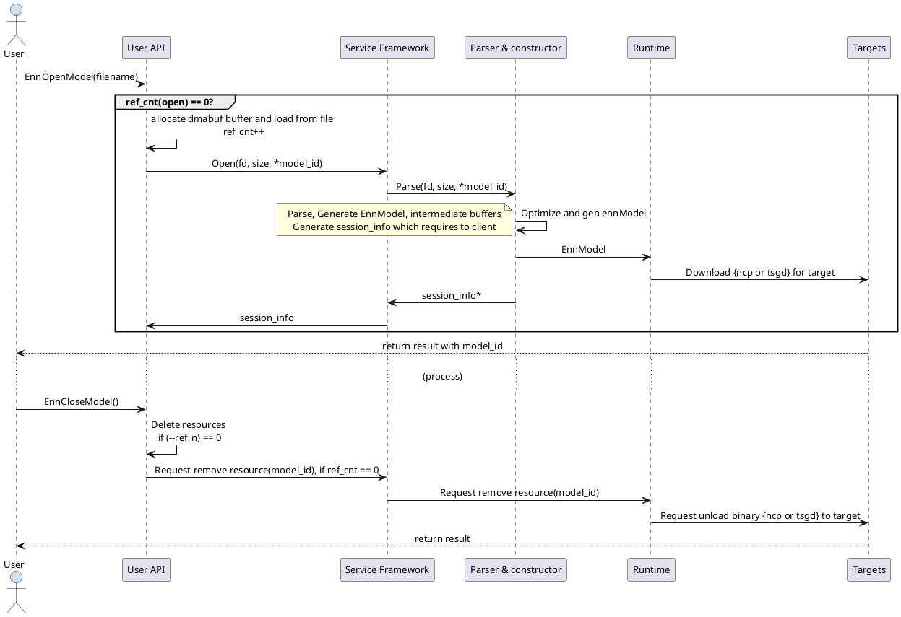
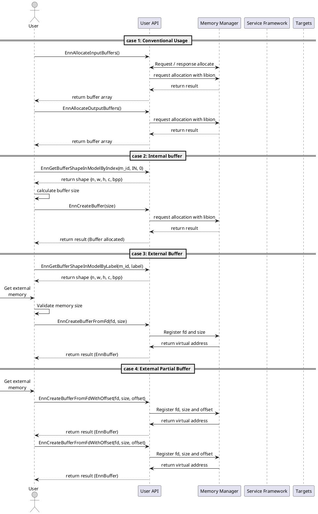
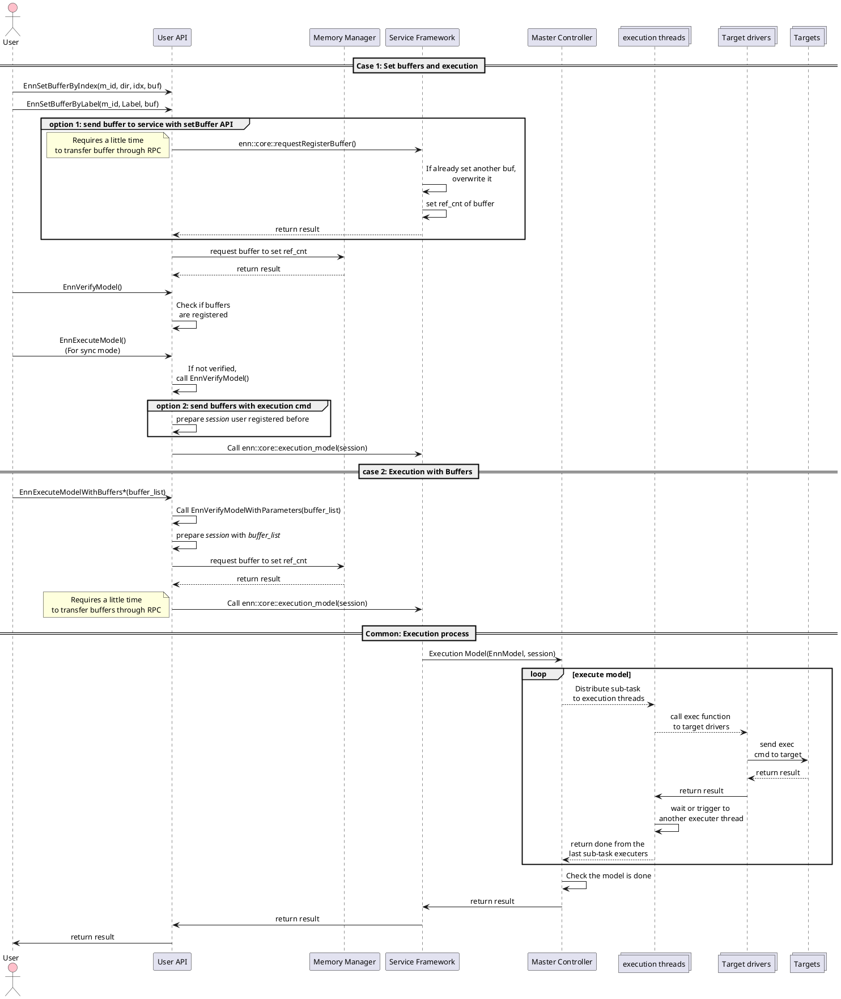
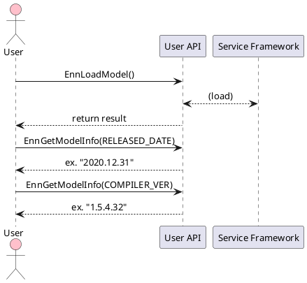

<i>This document simply describe API use cases</i>

### 1. Model LifeCycle

```plantuml
skinparam DefaultTextAlignment center
skinparam defaultFontSize 13
actor User as user #CFE2F3
participant "ENN Framework" as enn
participant "Targets(NPU, DSP,..)" as target
user->enn: Enninitialize()
enn->target: initialize targets
user->enn: EnnOpenModel()
enn->target: parse and download model to target
alt Buffer(memory) related actions
group conventional approach
user->enn: EnnAllocateInputBuffers()
enn->user: buffer list for input
user->enn: EnnAllocateOutputBuffers()
enn->user: buffer list for output
end
group new: get each buffer's information
user->enn: EnnGetBufferShapeByLabel()
enn->user: return buffer shape with label
user->enn: EnnGetBufferShapeByIndex()
enn->user: return buffer shape with label
end
group new: Create own buffer
user->enn: EnnCreateBuffer()
enn->user: return buffer
end
group new: Import Export Buffer
user->enn: EnnCreateBufferFromFd()
enn-->user: return buffer
user->enn: EnnCreateBufferFromFdWithOffset()
enn-->user: return buffer
end
group new: Set buffer to model
user->enn: EnnSetBufferByIndex()
enn->user: return result
user->enn: EnnSetBufferByLabel()
enn->user: return result
end
end
group new: Get model information
user->enn: EnnGetModelInfo(COMPILER_VER)
user->enn: EnnGetModelInfo(MODEL_VER)
user->enn: EnnGetModelInfo(MODEL_DESC)
enn-->user: (return with string parameter)
end
group new: Model verification
user->enn: EnnVerifyModel()
enn->user: return result
end
user->enn: EnnExecuteModel()
enn->target: Send Execute Command with buffer information
target-->user: return result
user->enn: EnnReleaseBuffers()
enn->user: return result
user->enn: EnnCloseModel()
enn->user: return result
user->enn: EnnDeinitialize()
enn->user: return result


```
<br>
### 2. Initialize / Deinitialize



<br>
### 3. EnnOpenModel / EnnCloseModel


####Expected Output (session info):
##### session_info
| type | name | description |
| ---|---|---|
| uint64_t | model_id | model identifier |
| vector<buffer> | buffers | buffer information for user [read only] |
| vector<region> | region | memory information for system [read only] |
<br>
####Buffer
* User view: User API can approach with this data structure
* Read only
* example:

##### buffer
| type | name | example | description |
| ---  | --- | ---| --- |
| int | region_idx | {0, 1, 2.. } | Index of region |
| int | direction | {IN, OUT, NONE} | is this buffer in/output of the graph? |
| int | size | 23823 | size of the buffer |
| int | offset | 123 | offset of the buffer : size+offset should be less then region[region_idx] size |
| shape_info | n x w x h x c | {1, 300, 400, 3} | if n >= 1, we can guess this buffer is array |
| int | buffer_type | {U8, RGBD, F32.. } | enum which defined in header |
| string | name | input_0 |name of edge(buffer). User can access memory with the name |
<br>
####Region
  * view as a system: the framework manage this and execute model with parameter generated from this data structure

##### region

| type | name | example | description |
|---|---|---|---|
| int  | attr | {MENDATORY \| IS_FD..} | contain multiple attributes: MANDATORY, IS_FD, if MANDATORY is not set, the user can skip the index, IS_FD means that this is used by HIDL |
| int | required_size | 10000 | size of the memory. {size + offset} should not be bigger than actual size |
| string | name | TEMP | name of region for debug or internal usage |
<br>
####Region as a parameter of execution_model()
  * Region as a parameter (user >> framework)
  * example
```c++
  /* 1. single execution */
  enn_execute_model(model_id, exec_region);  // execute once with exec_region

  /* 2. multiple execution */
  enn_memory_commit(model_id, vec<exec_region>);  // prepare region set to service framework
  enn_execute_model_with_region_idx(model_id, region_id); // execute with commited exec_region
```
##### exec_region

| type | name | example | description |
|---|---|---|---|
| int | attr | {BLANK, IS_FD..} | Attribute. If BLANK is set, this index is ignored by the framework. this can be set if MENDATORY is not set in returned session_info | 
| int  | fd | {0, 1, 2.. } | file descriptor |
| addr_t | address | 0x82372311dd00 | if libmode, address will be sent without IS_FD type |
| int | size | 10000 | size of the memory. {size + offset} should not be bigger than actual size |
| int | offset | 123 | start point of value |


<br>
### 4. Memory related actions
*> if you want to recent usage, you can refer api_test_sample_?_blabla in enn_api-test.cc*

> Basically, User set executable buffers with 3 stages
> 1. Set Ext-buffers: user can manage simple buffer array
> > ```c++
> >    EnnBuffer** ext_buf_array;
> >    // Array must be managed by in-out-ext order
> >    // This should be same with you returns after calling EnnAllocateAllBuffers()
> > ```
> 2. Update Ext-buffers to Model Container
> > ```c++
> >    EnnSetBuffers(model_id, ext_buf_array, (n_in + n_out + n_ext));
> >    EnnSetBufferByIndex(model_id, (IN or OUT), index, buffer);
> >    EnnSetBufferByLabel(model_id, label, buffer);
> > ```
> 3. Commit buffers to register to service runtime (model manager)
> > ```c++
> >    EnnBufferCommit(model_id);
> > ```


<br>
### 5. Execution Model // to be updated



* *<i>EnnExecuteModelWithBuffers(buffer_list)</i> and <i>EnnVerifyModelWithParamters()</i> will be used if asynchronous mode is supported

<br>
### 6. Other Usages


