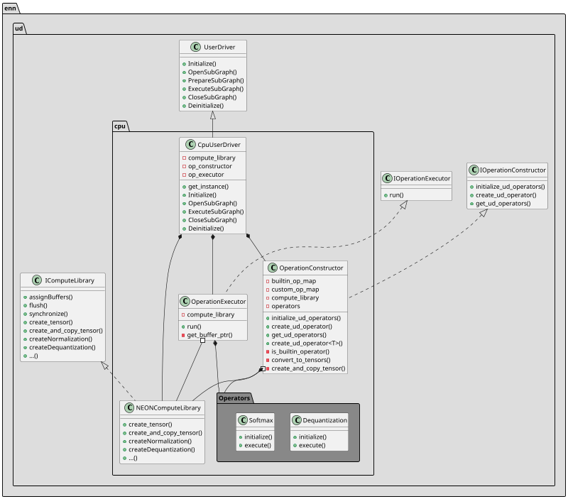
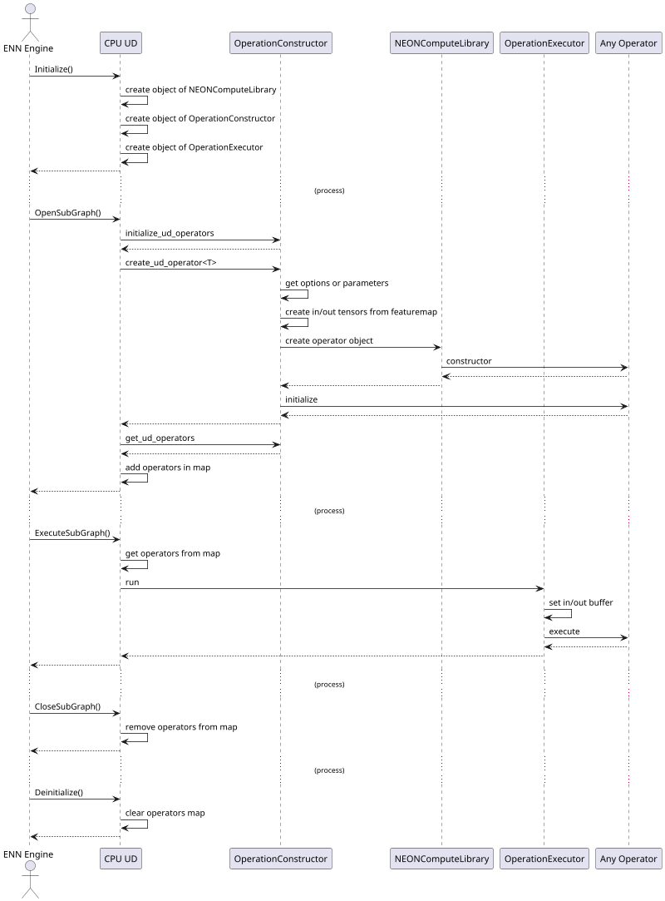

# Userdriver(UD) Interface

## CPU UD Interface

- CPU UD initializes and executes CPU operators requested by ENN engine.
- CPU UD manages the map of UDOperators created by OperatorConstructor.
- OperatorConstructor collects the options or parameters of each operator and then initializes the operator with it.
- OperatorExecutor set the input/output buffer address allocated from user(client layer) to each operator and then executes the operator.
- NEONComputeLibrary creates each CPU operator's object pointer. And supports methods to create tensor that it is a data tranfered to each operator.

## CPU UD APIs
#### get_instance()
    CpuUserDriver is created as singleton object.
    ENN engine creates it and then calls UD APIs.
#### Initialize()
    Called from Engine::init().
    Create objects of NEONComputeLibrary, OperationConstructor and OperationExecutor.
#### OpenSubGraph()
    Called from Engine::open_model().
    Uses OperationConstructor and initializes each operator in OperatorList.

|Type|Name|Description|
|---|---|---|
|std::shared_ptr<<model::component::OperatorList>>|operator_list|The operator list created with Graph composed of vertex and edge|
|UdSubGraphPreference&|preference|Not used in CPU UD|

#### ExecuteSubGraph()
    Called from Engine::execute_model().
    Get UDOperators from a map managed in CPU UD.
    Uses OperationExecutor and set buffers with each buffer index from BufferTable.
    Then executes each operator.

|Type|Name|Description|
|---|---|---|
|uint64_t|operator_list_id|An unique id created in OpenSubGraph to manage operator list|
|model::memory::BufferTable&&|buffer_table|The indexed map composed input/output buffer of each operator|

#### CloseSubGraph()
    Called from Engine::close_model().
    Removes UDOperators from the map.

|Type|Name|Description|
|---|---|---|
|uint64_t|operator_list_id|An unique id created in OpenSubGraph to manage operator list|

#### Deinitialize()
    Called from Engine::deinit().
    Clear the UDOperators' map.

## CPU UD call sequence
