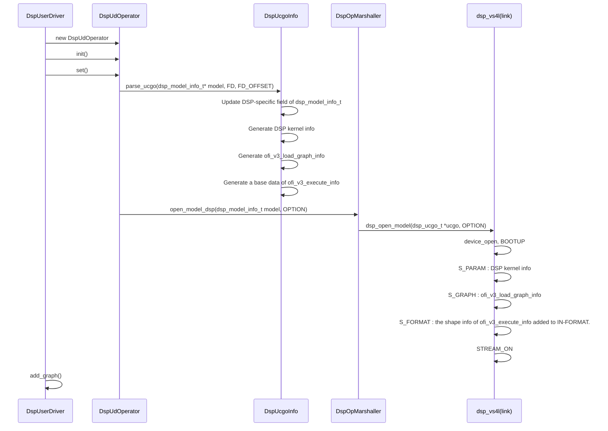
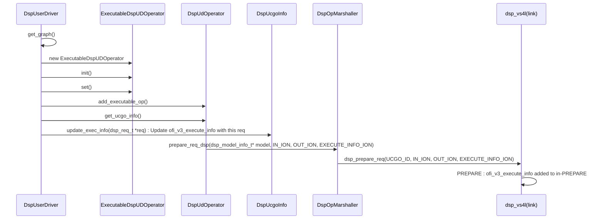
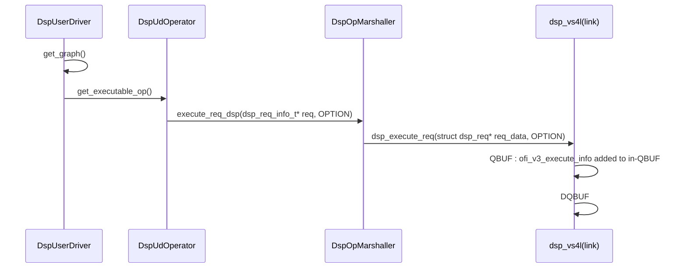

DSP UD Development Step1 documentation
Latest update date: 21 May 2021


<b> 1. Abstraction </b>
> * Initial code of DSP UD is created by copying NPU UD code.
> * So Basic flow of DSP UD is same as NPU UD.
> * Major difference is that DSP UD needs additional data structure for DSP Firmware.
> * And the data is gathered from UCGO(=NCP).
> * So DSP UD parses UCGO by itself.
> * TODO : Need to support CGO.

</br>

<b> 2. DSP specific data struct </b>
> a) DSP kernel information
>> * DSP kernel info : simple short string & meta data of the string
>> * Packed as vs4l_param.
>> * Used as parameter for IOCTL::S_PARAM

> b) struct ofi_v3_load_graph_info
>> * dsp-specific graph info.
>> * ION memory
>> * Packed as vs4l_graph for IOCTL::S_GRAPH


> c) struct ofi_v3_execute_info
>> * DSP-specific execute(request) info.
>> * ION memory
>> * This memory will be appended to input container for IOCTL::QBUF in. (Also the count of vs4l_container_list will be increased.)
>> * A shape info of this memory is also appended to IOCTL::S_FORMAT in. (Also the count of vs4l_format_list will be increased.)
>> * Base struct is created at openModel time.
>> * At execute time, We just update new info to the base struct and send it to D/D.
>> * TODO: Now We only have one single struct. It will be better to have each struct per request for non-blocking execution.

<br></br>

<b> 3. Parsing UCGO </b>
> a) Get UCGO from ENN
>> * model::component::Operator::get_binaries()
>> * binary fd is NNC's.
>> * So use offset and size to get UCGO area.

> b) Parse UCGO with class DspUcgoInfo
>> * Parse UCGO and fill out the members of DspUcgoInfo.
>> * DspUcgoInfo : Data class per UCGO.

```c++
Class DspUcgoInfo {
   …
private:
     /* TODO: Remove this */
     eden_memory_t packed_info_;
     /* memory for S_GRAPH. type:ofi_v3_load_graph_info */
     eden_memory_t loadgraph_info_;
     /* Base data struct for ofi_v3_execute_info */
     eden_memory_t exec_info_;
     /* TSGD is a DSP-specific model data for DSP firmware */
     eden_memory_t tsgd_info_;
     ofi_v3_param_t tsgd_param_;
     /* ION memories allocated by DSP-UD */
     std::map<uint32_t, eden_memory_t> ucgo_buffer_map_;
     /* Parameter entry for ofi_v3_load_graph_info */
     std::map<uint32_t, ofi_v3_param_t> ucgo_param_map_;
     /* To map ucgo in,out to nnc in,out */
     std::map<uint32_t, uint32_t> nnc_input_map_;
     std::map<uint32_t, uint32_t> nnc_output_map_;
     /* DSP kernel info */
     uint8_t* kernel_name_;
     int32_t kernel_name_size_;
     int32_t kernel_name_count_;
     /* Unique model id for DSP DD/FW */
     uint32_t global_id_;
}
```


<br></br>

<b> 4. openModel() sequence diagram </b>
* You need mermaid plugin to show the sequence diagram.
* Some func parameters are omitted to make figure simple.


<br></br>

<b> 5. prepareModel sequence diagram </b>
* You need mermaid plugin to show the sequence diagram.
* Some func parameters are omitted to make figure simple.


<b> 6. executeModel sequence diagram </b>
* You need mermaid plugin to show the sequence diagram.
* Some func parameters are omitted to make figure simple.


<br></br>

<b> 6. TODO : Support CGO </b>
> * dependancy : CGO parser output format
