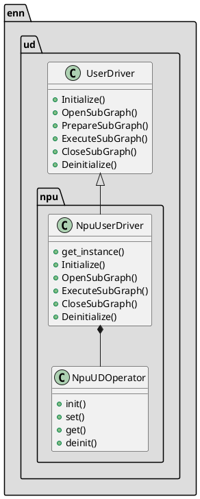
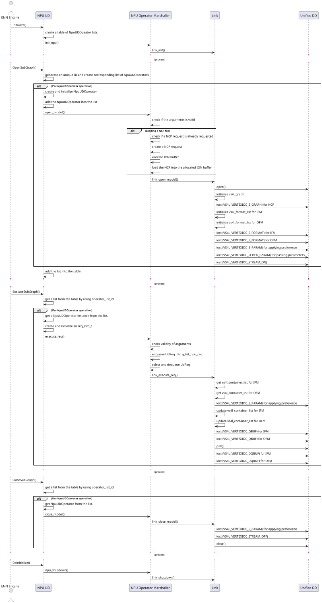

# Userdriver(UD) Interface

## NPU UD Interface

- NPU UD inputs a NPU operator list from ENN engine, and sequentially sends a NPU operator of the list to the unified device driver by using VS4L (vision for Linux).
- NPU UD consists of NPU operator list manager and NPU operator marshaller.
- NPU operator list manager has a table the list of operator lists and adds or deletes a operator list in the table.
- NPU operator marshaller marshals a NPU operator by using VS4L.
- NPU UD has six functions, such as Initialize(), OpenSubGraph(), PrepareSubGraph(), ExecuteSubGraph(), CloseSubGraph(), Deinitialize().

## NPU UD APIs
ENN engine calls the following APIs.
#### get_instance()
NpuUserDriver instance is created as a singleton object.
#### Initialize()
Engine::init() calls get_instance() which initializes NPU operator marshaller by invoking init_npu().

#### OpenSubGraph()
Engine::open_model() invokes OpenSubGraph() which inputs a list of operators and add the list into the table. It creates a NpuUDOperator including the model_info_t instance. It sequentially calls open_model() API for each NpuUDOperator.
|Type|Name|Description|
|---|---|---|
|std::shared_ptr<<model::component::OperatorList>>|operator_list|The operator list created with Graph composed of vertex and edge|
|UdSubGraphPreference&|preference|A set of preferences of NPU DD|

#### ExecuteSubGraph()
Engine::execute_model() invokes ExecuteSubGraph(). It gets the list of NpuUDOperators, and sequentially calls execute_req() for each NpuUDOperator.

|Type|Name|Description|
|---|---|---|
|uint64_t|operator_list_id|An unique id created in OpenSubGraph() to manage operator list|
|const model::memory::BufferTable&&|buffer_table|The indexed map composed input/output buffer of each operator|

#### CloseSubGraph()
Called from Engine::close_model().
Removes corresponding instance of the list of NpuUDOperators from the table.

|Type|Name|Description|
|---|---|---|
|uint64_t|operator_list_id|An unique id created in OpenSubGraph() to manage operator list|

#### Deinitialize()
Called from Engine::deinit(). Release the table.

## NPU UD call sequence

